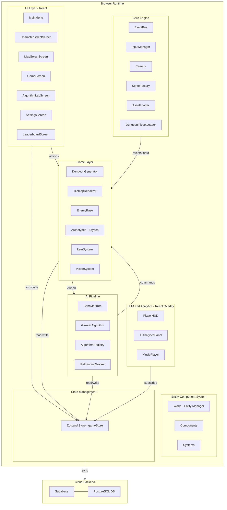
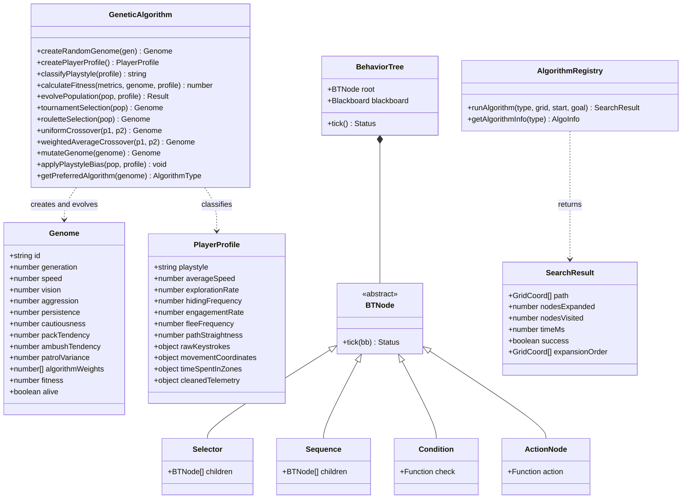
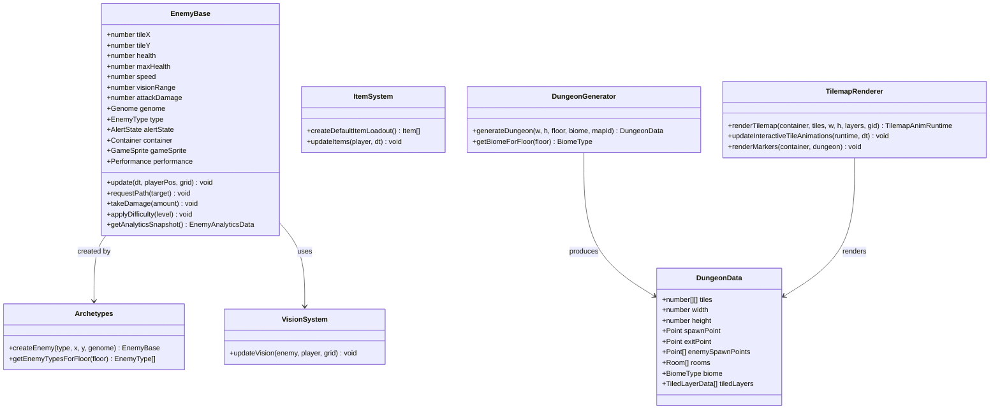
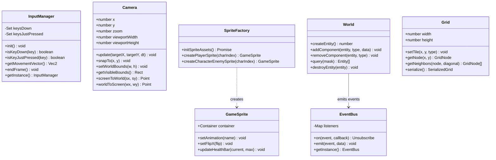
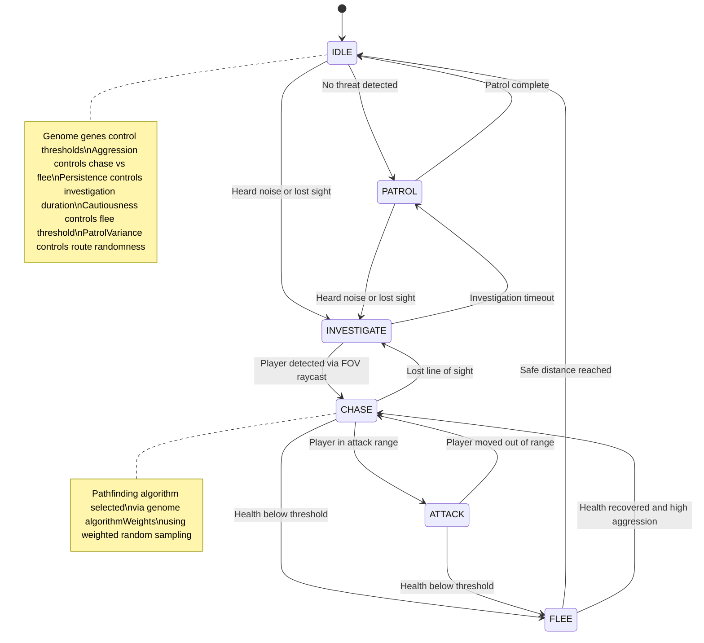
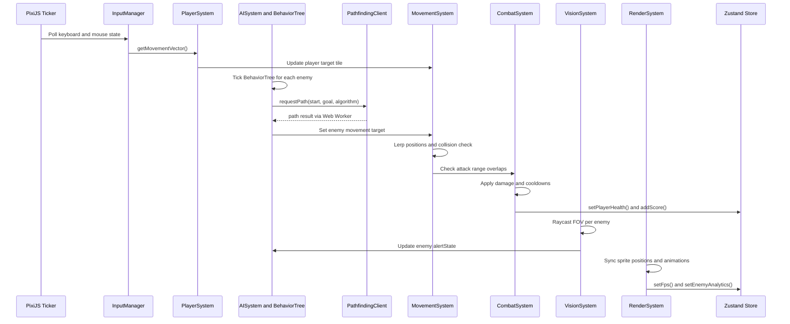
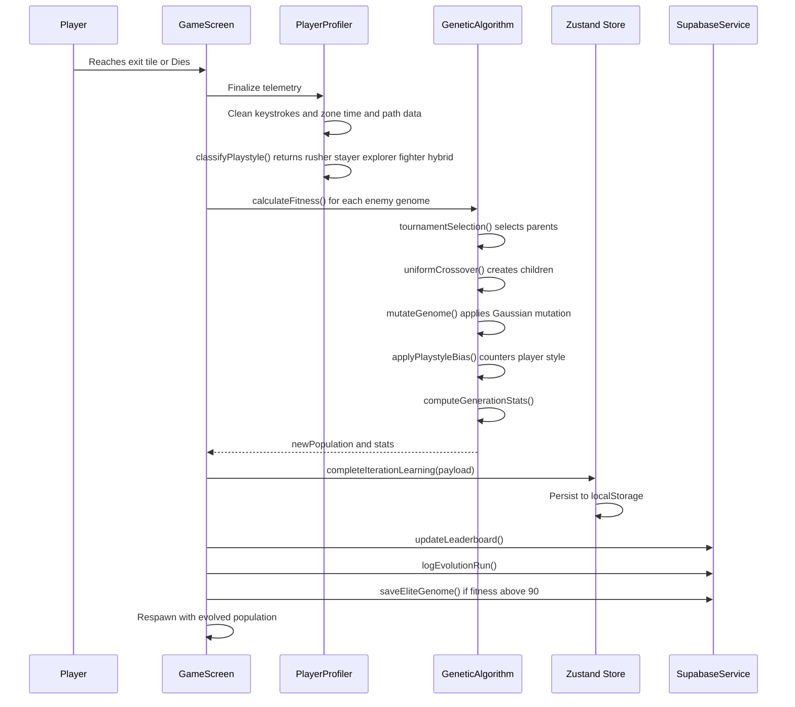
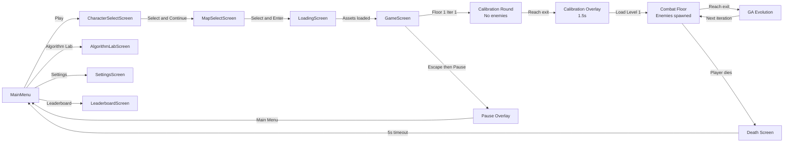

# EvoCracker — Architecture Diagrams

This document contains UML architecture diagrams for the EvoCracker project, rendered using Mermaid syntax.

---

## 1. High-Level System Architecture

---

## 2. AI Subsystem — Class Diagram

---

## 3. Game Entities — Class Diagram

---

## 4. Core Engine — Class Diagram

---

## 5. Enemy AI — State Machine Diagram

---

## 6. Game Loop — Sequence Diagram (Single Frame)

---

## 7. Genetic Algorithm Evolution — Sequence Diagram

---

## 8. Screen Navigation Flow

